# Architecture Overview

> **Targets:** Bun 1.3.11+ | TypeScript 5.x
> **Last updated:** 2026-05-20
> **Conventions:** See [../../guides/documentation-guide.md](../../guides/documentation-guide.md)

eventgate is a single-process Bun service that ingests webhooks from configured sources and durably persists them to Kafka. The gateway accepts any valid JSON POST on each configured route path and writes it verbatim to that route's Kafka topic via a local SQLite outbox. Routes are data — the set is declared in `config.routes[]` (defaults + env-or-file overrides) and validated at startup against an org-wide topic naming policy. Validation, normalization, alerting, and projection are concerns for downstream consumers in other services.

For the per-request and per-reload message sequences, see [request-flows.md](request-flows.md).

## System Diagram

```mermaid
flowchart LR
    classDef external fill:#eef,stroke:#447,stroke-width:1px
    classDef configLayer fill:#fef9d7,stroke:#a87,stroke-width:1px
    classDef gateway fill:#e3f3e3,stroke:#373,stroke-width:1px
    classDef outbox fill:#fde4d6,stroke:#a52,stroke-width:1px
    classDef provider fill:#dde9f5,stroke:#357,stroke-width:1px
    classDef kafka fill:#f5d6d6,stroke:#933,stroke-width:1.5px

    subgraph external["External"]
        autoops["Elastic AutoOps<br/>(and other webhook sources)"]
        admin["Operator tooling<br/>(PUT /admin/routes)"]
    end

    subgraph config["Config layer (lazy, validated at first read)"]
        direction TB
        defaults[("defaults.ts<br/>seed route")]
        envjson[("ROUTES_JSON<br/>env override")]
        routesfile[("ROUTES_FILE<br/>mounted file")]
        schemas["Zod routesSchema<br/>+ topicPolicy + reservedPaths<br/>+ idempotencyStrategies"]
        defaults --> schemas
        envjson --> schemas
        routesfile --> schemas
        routesfile -. "wins over" .-> envjson
        envjson -. "wins over" .-> defaults
    end

    subgraph gw["Gateway process (Bun.serve, port 3000)"]
        direction TB
        routes["routes.ts<br/>builds route map from config.routes"]
        healthz["GET /healthz<br/>(reserved path)"]
        adminEp["PUT /admin/routes<br/>(reserved path, conditional)"]
        handler["handler.ts<br/>makeWebhookHandler per route"]
        strategies["idempotencyStrategies<br/>(named registry)"]
        routes --> healthz
        routes --> adminEp
        routes --> handler
        handler --> strategies
    end

    subgraph ob["Outbox (in-process, single-writer)"]
        direction TB
        writer["writer.ts<br/>enqueue → SQLite"]
        db[("bun:sqlite<br/>outbox.db")]
        drainer["drainer.ts<br/>poll → publish<br/>exp. backoff, age-based give-up"]
        adminFile[("ROUTES_FILE<br/>atomic-write on PUT")]
        writer --> db
        db --> drainer
    end

    subgraph kafkaLayer["Kafka boundary"]
        direction TB
        producer["producer.ts<br/>EventProducer"]
        factory["providers/index.ts<br/>createKafkaProvider"]
        local["local<br/>(Redpanda)"]
        msk["msk<br/>(IAM/TLS/none)"]
        confluent["confluent<br/>(SASL/PLAIN+TLS)"]
        factory --> local
        factory --> msk
        factory --> confluent
        producer --> factory
    end

    kafka[("Kafka topics<br/>T_PRIVATE_SOURCE_*<br/>DLQ_T_* (downstream consumers only)")]

    autoops -->|"POST /webhooks/..."| routes
    admin -->|"PUT, X-Admin-Token"| adminEp
    adminEp -->|"validate → write → server.reload"| adminFile
    adminEp -.->|"on success"| routes
    handler -->|"enqueue(topic=route.topic)"| writer
    handler -.->|"fallback when OUTBOX_ENABLED=false"| producer
    drainer -->|"sendByTopic"| producer
    producer -->|"produce"| kafka

    schemas -.->|"validated config consumed at startup"| routes
    schemas -.->|"validated config consumed at startup"| ob

    class autoops,admin external
    class defaults,envjson,routesfile,schemas configLayer
    class routes,healthz,adminEp,handler,strategies gateway
    class writer,db,drainer,adminFile outbox
    class producer,factory,local,msk,confluent provider
    class kafka kafka
```

Read the diagram top-to-bottom by layer:

1. **External** — the inbound webhook senders (one per configured route path) and the operator tooling that may call the admin endpoint.
2. **Config layer** — three sources of truth for routes, resolved at the lazy Proxy's first read. `ROUTES_FILE` wins over `ROUTES_JSON` wins over checked-in `defaults`. Zod's `routesSchema` rejects everything that violates the naming policy, the reserved-path list, or the per-route uniqueness rules.
3. **Gateway** — `Bun.serve` with two reserved operational paths (`/healthz`, `/admin/routes`) plus one POST handler per `config.routes[i]`. Every webhook handler is the same `makeWebhookHandler` factory, parametrised on its `RouteConfig`. The idempotency strategies registry is the only place per-source code lives.
4. **Outbox** — single-writer SQLite (`bun:sqlite`) sits between the HTTP accept and the Kafka publish so AutoOps-style "no retries" webhook senders don't lose data on Kafka outages. The drainer polls, publishes, and gives up by age. The admin endpoint atomically writes to `ROUTES_FILE` before hot-reloading the route map.
5. **Kafka boundary** — the producer is provider-agnostic. The provider factory dispatches on `KAFKA_PROVIDER` to local Redpanda, AWS MSK (IAM/TLS/none), or Confluent Cloud (SASL/PLAIN+TLS).

## Process

| Process | Entry point | Responsibility |
|---|---|---|
| gateway | `src/gateway/index.ts` | Accept JSON POSTs on every path declared in `config.routes[]`, enqueue verbatim into the SQLite outbox tagged with the route's topic, return `202`. Reports producer status, outbox stats, and the live route list on `/healthz`. When `ADMIN_TOKEN` + `ROUTES_FILE` are both set, also serves `PUT /admin/routes` for in-process route reconfiguration. |

There is no consumer, normalizer, or projector in this repo. Add new downstream behaviour (Slack, PagerDuty, rolling aggregates, sinks into a database) as a **separate consumer service** subscribed to the relevant `T_PRIVATE_SOURCE_*` topic — never bolt it into the gateway.

## Kafka topics (naming policy)

Topics are declared per route in `config.routes[].topic` and validated at startup. The gateway is the source connector in the org-wide naming taxonomy:

| Pattern | Use | Example |
|---|---|---|
| `T_PRIVATE_SOURCE_<SYSTEM>_<ENTITY>` | Gateway-owned. Verbatim webhook body. Opportunistic `idempotencyKey` header set when a named strategy applies. | `T_PRIVATE_SOURCE_ELASTIC_AUTOOPS` |
| `DLQ_T_<topic>` | Companion DLQ name. Optional. Declared on the route so downstream consumers can introspect it; **the gateway never publishes here.** | `DLQ_T_PRIVATE_SOURCE_ELASTIC_AUTOOPS` |

The following are explicitly forbidden as gateway topics, each with a distinct startup error: `T_PUBLIC_*` (MDM publisher, not us), `T_PRIVATE_SINK_*` (sink connectors, not us), `T_PRIVATE_*_RICH_NOTIFICATIONS` / `T_PRIVATE_*_EVENTS` (internal streams, not gateway-owned), `DLQ_T_*` as a primary topic, and any Kafka/Confluent system prefix (`__*`, `_schemas`, `_confluent-*`).

Topic length is capped at the Kafka maximum of 249 characters.

## Routes, reserved paths, and the admin endpoint

| Aspect | Behaviour |
|---|---|
| **Source priority** | `ROUTES_FILE` > `ROUTES_JSON` > `src/config/defaults.ts`. Whichever wins, the full array is validated by Zod. Either of the first two failing parse or validation → process refuses to start. |
| **Reserved paths** | `/healthz` and `/admin/routes` cannot appear in `config.routes[].path`. Startup error: `path '/healthz' is reserved for operational use`. |
| **Per-route validation** | Unique `path`, unique `topic`, unique `dlqTopic` (when set), naming policy on `topic`, `dlqTopic === DLQ_T_<topic>` exactly, `idempotency` (when set) must reference a strategy in `src/gateway/idempotencyStrategies.ts`. |
| **Admin endpoint** | `PUT /admin/routes` (X-Admin-Token-protected) registers iff **both** `ADMIN_TOKEN` (min 32 chars) and `ROUTES_FILE` are set. Without persistence the endpoint is intentionally not registered — in-memory-only edits would be lost on restart, an explicit no-footgun guard. |
| **Hot reload** | Successful PUT writes the file atomically (`Bun.write` to `<path>.tmp` then `renameSync`) then calls `server.reload({ routes })` with the rebuilt route map. In-flight requests on old handlers complete safely; each handler is a pure closure over its own frozen `RouteConfig`. |

For per-request and per-reload sequence diagrams see [request-flows.md](request-flows.md).

## Kafka provider factory

The gateway connects to Kafka through a provider abstraction selected by `KAFKA_PROVIDER`:

| Provider | Auth | When |
|---|---|---|
| `local` | PLAINTEXT | Local development against Redpanda |
| `msk` | OAUTHBEARER (IAM), TLS, or none | AWS MSK / MSK Serverless |
| `confluent` | SASL/PLAIN over TLS | Confluent Cloud |

See [kafka-provider-factory.md](kafka-provider-factory.md) for env vars, field requirements, and the portable pattern.

## Failure handling

| Failure | Where | Action |
|---|---|---|
| Invalid JSON body | gateway handler (`src/gateway/handler.ts`) | Return `400`, do not enqueue |
| Outbox enqueue fails | gateway handler | Return `500`; the row is not durable, so the caller learns the truth |
| Kafka publish failure | outbox drainer (`src/outbox/drainer.ts`) | Increment attempts, exponential backoff (`min(2^(n-1) * 1s, backoffMaxMs)`), eventually `status='failed'` after `OUTBOX_MAX_AGE_HOURS` |
| Admin auth fail | admin endpoint | Return `401`, no state change |
| Admin body validation fail | admin endpoint | Return `400` with Zod issues, no state change |
| Admin persistence fail | admin endpoint | Return `500`, no `server.reload` |
| Admin reload fail (after successful persist) | admin endpoint | Return `500` with a distinguishable message; file is written, next process restart applies the change |
| Producer disconnected | `/healthz` | Report `producer.connected: false`, return `503` |
| Reserved-path collision in `config.routes` | startup Zod | Refuse to start with `path 'X' is reserved` |
| Topic naming violation | startup Zod | Refuse to start with a per-prefix distinct message |

## Configuration

Configuration follows the 4-pillar pattern — defaults, env mapping, schema, loader — and is documented in [../configuration/environment-variables.md](../configuration/environment-variables.md). Routes have their own three-source resolution layered on top (file > env > defaults). Production safety rules are enforced by `.superRefine()` in `src/config/schemas.ts`:

- `provider=local` is rejected when `ENVIRONMENT=prod` (prod must use `msk` or `confluent`).
- `msk` requires `MSK_REGION` plus one of `MSK_CLUSTER_ARN` / `MSK_BROKERS`.
- `confluent` requires `CONFLUENT_BOOTSTRAP_SERVERS`, `CONFLUENT_API_KEY`, `CONFLUENT_API_SECRET`.
- `routes` must be non-empty; each route must satisfy the naming policy, uniqueness, reserved-path, and idempotency-strategy rules.
- `admin.token`, when present, must be ≥ 32 characters.

For the project-agnostic 4-pillar pattern see [../../guides/4-pillar-configuration-guide.md](../../guides/4-pillar-configuration-guide.md). For the project-agnostic provider factory pattern see [../../guides/kafka-provider-factory.md](../../guides/kafka-provider-factory.md).

## Out of scope

Documented separately in `CLAUDE.md` and the v1 plan; flagged here so readers know not to look for them in this overview:

- **Webhook authentication for public webhook paths** — the admin endpoint is authed, the webhook endpoints are not (still deferred to v2).
- Flink rolling aggregates.
- OpenTelemetry instrumentation.
- Any database integration in this repo — downstream consumers own their storage.
- `DELETE` or `PATCH` on the admin endpoint — full-replacement `PUT` only.
- Multi-writer coordination on `ROUTES_FILE` — single-writer per file assumed.

## See also

- [request-flows.md](request-flows.md) — per-request and per-reload sequence diagrams.
- [kafka-provider-factory.md](kafka-provider-factory.md) — the provider abstraction the gateway uses to reach Kafka.
- [outbox.md](outbox.md) — outbox internals and durability guarantees.
- [../api/webhooks.md](../api/webhooks.md) — request and response shapes for the gateway endpoints.
- [../deployment/aws-ecs.md](../deployment/aws-ecs.md) — how the gateway is deployed.
- [../operations/logging.md](../operations/logging.md) — log shape and filter patterns.
- [../plans/v1-implementation-plan.md](../plans/v1-implementation-plan.md) — original design rationale (historical; predates SIO-802/803).

## Changelog

| Date | Change |
|---|---|
| 2026-05-19 | Initial architecture overview created |
| 2026-05-19 | Rewritten for gateway-only architecture: removed writer + Couchbase doc model, added Kafka provider factory layer (SIO-795) |
| 2026-05-19 | Accept-everything contract: gateway no longer validates or normalizes; only `raw.v1` is written; `events.v1` and `dlq.v1` reserved for future consumers (SIO-801) |
| 2026-05-19 | Config-driven routes: `config.routes[]` replaces the hardcoded single route; topic naming policy `T_PRIVATE_SOURCE_<SYSTEM>_<ENTITY>` enforced at startup; `ROUTES_JSON` env override; Elastic AutoOps topic renamed (SIO-802) |
| 2026-05-20 | Reserved-path guard for `/healthz` and `/admin/routes`; `PUT /admin/routes` admin endpoint (X-Admin-Token, Zod-validated, atomic-write persistence, hot reload); `ROUTES_FILE > ROUTES_JSON > defaults` precedence (SIO-803) |
| 2026-05-20 | Overview rewrite: Mermaid system diagram, request flows split into companion file (SIO-804) |
