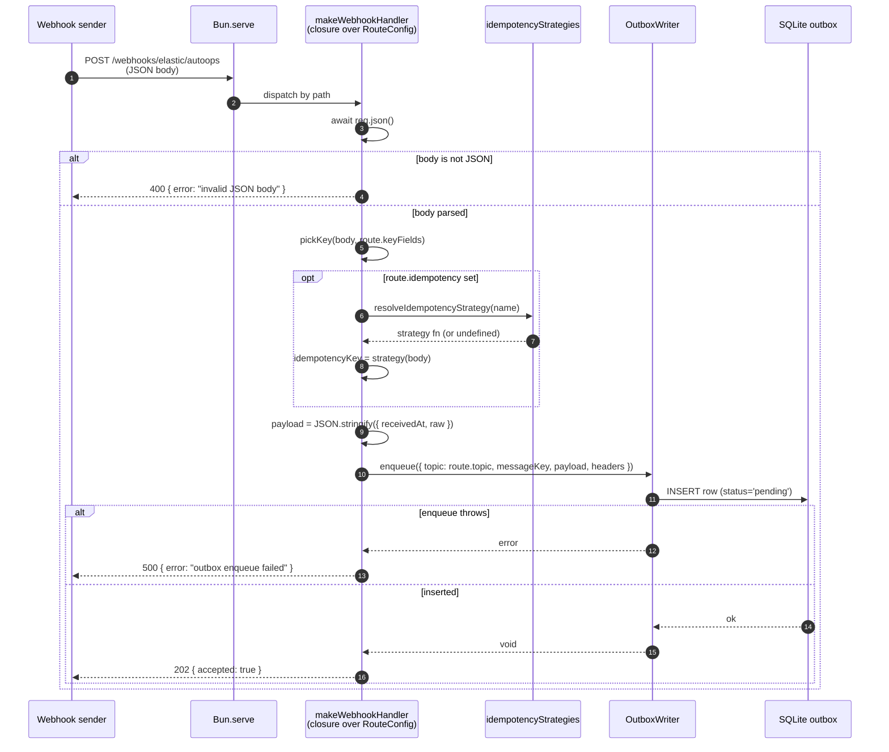
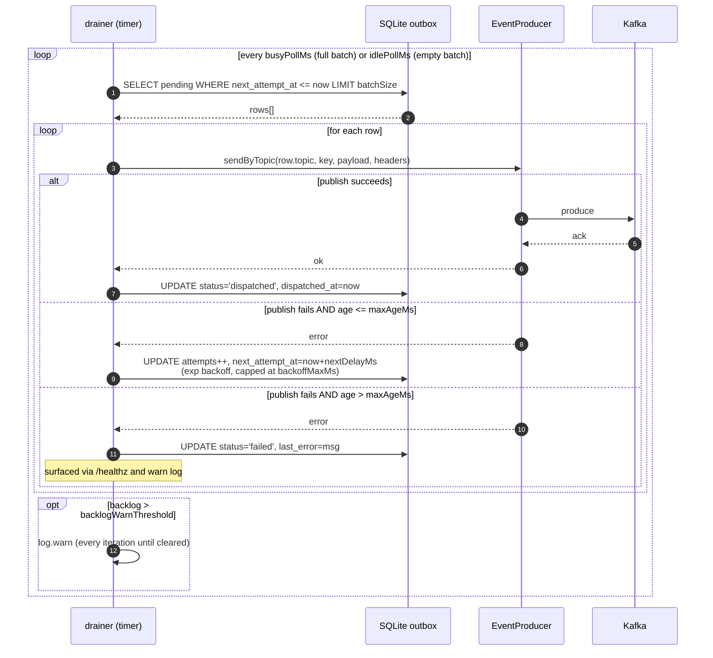

# Request Flows

> **Targets:** Bun 1.3.11+ | TypeScript 5.x
> **Last updated:** 2026-05-20
> **Conventions:** See [../../guides/documentation-guide.md](../../guides/documentation-guide.md)

Per-request and per-reload sequence diagrams. For the layer-level system view, see [overview.md](overview.md).

Two flows are covered:

1. **Webhook ingest** — a POST against any configured route path. Hot path; runs continuously in steady state.
2. **Admin reload** — an authenticated `PUT /admin/routes` that rewrites the live route map. Cold path; fires only when an operator changes the route configuration.

The drainer is decoupled from request handling — it runs on a timer inside the same Bun process. Its loop is shown after the webhook diagram.

---

## 1. Webhook ingest

External webhook sender (Elastic AutoOps, Datadog, whatever has been configured) POSTs JSON to its route path. The handler enqueues to the outbox and returns `202` immediately. Publishing to Kafka happens asynchronously in the drainer.



**Key invariants**
- Auth-free for public webhook paths (deferred to v2).
- The handler never blocks on Kafka — by the time `202` returns, the payload is durably in SQLite.
- The idempotency strategy is resolved once at handler construction time, not per request. The diagram shows the per-request derivation of the key.
- The outbox row's `topic` column stores the full Kafka topic name (e.g. `T_PRIVATE_SOURCE_ELASTIC_AUTOOPS`), not an enum key.

### Drainer loop (background, same process)

The drainer polls SQLite and publishes pending rows to Kafka. Independent of any request.



**Key invariants**
- At-least-once delivery. Downstream consumers may dedupe on the opportunistic `idempotencyKey` Kafka header when the source applies it.
- The drainer is the single writer to Kafka. Multiple processes pointing at the same SQLite file is unsupported.
- Rows aged beyond `maxAgeHours` are quarantined, not retried forever. Surfaced via `/healthz` so operators see them.

---

## 2. Admin route reload

Operator tooling (curl, internal CLI, whatever) calls `PUT /admin/routes` with a full replacement route array. Auth → Zod → atomic-write → hot reload. Persisted to `ROUTES_FILE` so the change survives a restart.

This endpoint registers only when **both** `ADMIN_TOKEN` and `ROUTES_FILE` are set. Without persistence the endpoint stays off (in-memory-only changes would be lost on restart — explicit no-footgun guard).

```mermaid
sequenceDiagram
    autonumber
    participant Op as Operator
    participant BS as Bun.serve
    participant A as makeAdminRoutesHandler<br/>(closure)
    participant Auth as verifyAdminToken<br/>(timing-safe)
    participant Z as routesSchema
    participant F as writeRoutesFile<br/>(atomic)
    participant Idx as gateway/index.ts<br/>rebuildRoutes
    participant Server as server.reload

    Op->>BS: PUT /admin/routes<br/>X-Admin-Token: <token>
    BS->>A: dispatch
    A->>Auth: verifyAdminToken(header, expected)
    alt missing or wrong token
        Auth-->>A: false
        A-->>Op: 401 { error: "unauthorized" }
    else token ok
        Auth-->>A: true
        A->>A: await req.json()
        alt body not JSON
            A-->>Op: 400 { error: "invalid JSON body" }
        else
            A->>Z: routesSchema.safeParse(body)
            alt validation fails
                Z-->>A: { success: false, error: { issues } }
                A-->>Op: 400 { error: "validation", issues }
            else valid
                Z-->>A: { success: true, data: routes[] }
                A->>F: writeRoutesFile(path, routes)
                F->>F: Bun.write(<path>.tmp, JSON.stringify)
                F->>F: renameSync(<path>.tmp, <path>)
                alt write throws (ENOSPC, EACCES, etc.)
                    F-->>A: error
                    A-->>Op: 500 { error: "persist failed" }
                else persisted
                    F-->>A: void
                    A->>Idx: onReload(routes)
                    Idx->>Idx: process.env.ROUTES_JSON = JSON.stringify(routes)
                    Idx->>Idx: resetConfigCache()
                    Idx->>Idx: buildRoutes(deps) with new config.routes
                    Idx->>Server: server.reload({ routes: newMap })
                    alt reload throws
                        Server-->>Idx: error
                        Idx-->>A: error (caught)
                        A-->>Op: 500 { error: "reload failed",<br/>message: "routes persisted; restart will apply" }
                    else reloaded
                        Server-->>Idx: ok
                        Idx-->>A: void
                        A-->>Op: 200 { routes: [...validated...] }
                    end
                end
            end
        end
    end
```

**Key invariants**
- Auth is the first check. The body is never parsed for an unauthenticated request.
- Zod validation runs after JSON parse — same `routesSchema` that gates startup, so the admin endpoint cannot accept a route the gateway would reject on boot. Reserved paths, naming policy, uniqueness rules all apply.
- Persistence is atomic. The new file is only visible after `renameSync`. A crash between `Bun.write` and `renameSync` leaves the old file intact.
- The reload is best-effort *after* persistence. If `server.reload` throws, the file is already updated — a process restart will pick up the new routes. The 500 response message tells the operator exactly that.
- In-flight requests on old route handlers complete safely. Each handler is a pure closure over its own frozen `RouteConfig`; nothing in the handler reads the route table at request time.
- The `onReload` callback uses `process.env.ROUTES_JSON` + `resetConfigCache()` as the bridge to push the new routes through the lazy config Proxy on the next `config.routes` access. The freshly mutated file is what will be read on the *next* process restart; runtime state is driven by the env-var bridge for this process's lifetime.

### Error matrix

| Failure mode | HTTP | Persistence side-effect | Live state |
|---|---|---|---|
| Token missing / wrong | 401 | none | unchanged |
| Body not JSON | 400 | none | unchanged |
| Zod validation fail | 400 | none | unchanged |
| File write fails | 500 (`persist failed`) | none (tmp may linger) | unchanged |
| `server.reload` throws | 500 (`reload failed; restart will apply`) | file IS updated | unchanged until restart |
| All succeed | 200 with validated routes | file updated | new route map active |

---

## See also

- [overview.md](overview.md) — system layer diagram and component descriptions.
- [outbox.md](outbox.md) — outbox internals: schema, backoff, give-up.
- [kafka-provider-factory.md](kafka-provider-factory.md) — how the producer's transport is chosen.
- [../api/webhooks.md](../api/webhooks.md) — endpoint reference (request/response shapes).
- [../../docs/superpowers/specs/2026-05-19-config-driven-routes-design.md](../superpowers/specs/2026-05-19-config-driven-routes-design.md) — SIO-802 spec (route layer).
- [../../docs/superpowers/specs/2026-05-20-admin-routes-endpoint-design.md](../superpowers/specs/2026-05-20-admin-routes-endpoint-design.md) — SIO-803 spec (admin endpoint).

## Changelog

| Date | Change |
|---|---|
| 2026-05-20 | File created with webhook-ingest, drainer-loop, and admin-reload sequence diagrams (SIO-804) |
